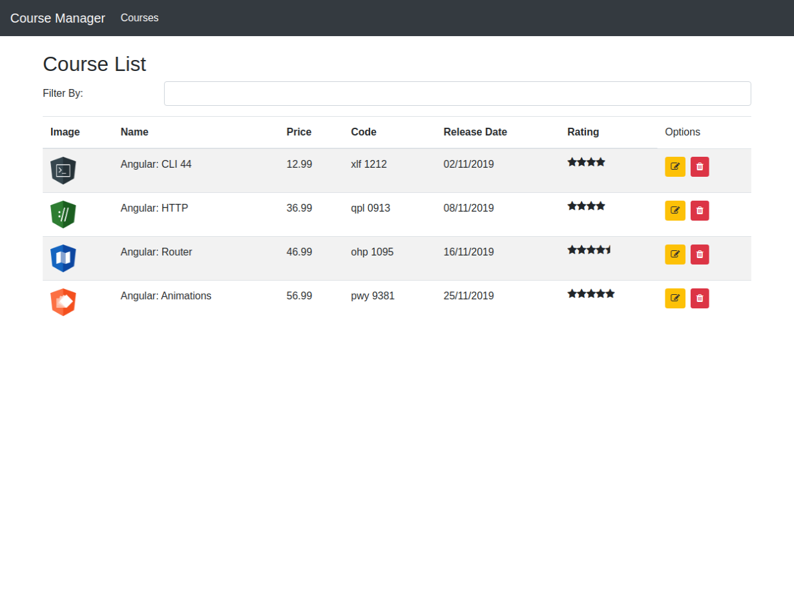

# Gerenciador de Cursos

> ## Sobre o projeto

Sistema gerenciador de cursos desenvolvido em Angular durante um dos cursos da [DIO](https://web.digitalinnovation.one/tracks).

O projeto possui algumas rotas para listagem dos cursos. Também sendo possível a edição ou remoção de alguns.

Foram utilizados diversos recursos que o Angular nos oferece para construção da aplicação. Para navegação entre rotas e manter-se uma SPA, o módulo de roteamento [RouterModule](https://angular.io/api/router/RouterModule) ofereceu diretivas, serviços, etc para que isso fosse possível.

Pipes nativos já disponíveis e criação de novos foram integrados ao projeto. Utilização de diretivas como `*ngFor` para trabalhar com loops ou `*ngIf` para renderização condicional não faltaram no projeto.

As informações exibidas e manipuladas na aplição são fornecidas por uma API. E utilizando o módulo [HttpClientModule](https://angular.io/api/common/http/HttpClientModule) foi possível aplicar os 4 verbos http e realizar o CRUD.

## Como rodar o projeto?

Clone este repositório

```
$ git clone https://github.com/vitorsemidio-dev/dio-ng-course-manager
```

Acesse a pasta

```
$ cd dio-ng-course-manager
```

Instale as dependências

```
$ npm install
```

⚠️ Ateção: Deve-se rodar o backend!

Acesse a pasta server e instale as dependências

```
$ cd server
$ npm install
```

Execute o backend

```
$ npm run start
# Aplicação estará disponível em http://localhost:3100/api/courses
```

Rode a aplicação Angular

```
$ npm run start
# Aplicação estará disponível em http://localhost:4200
```

## Imagens do Projeto


